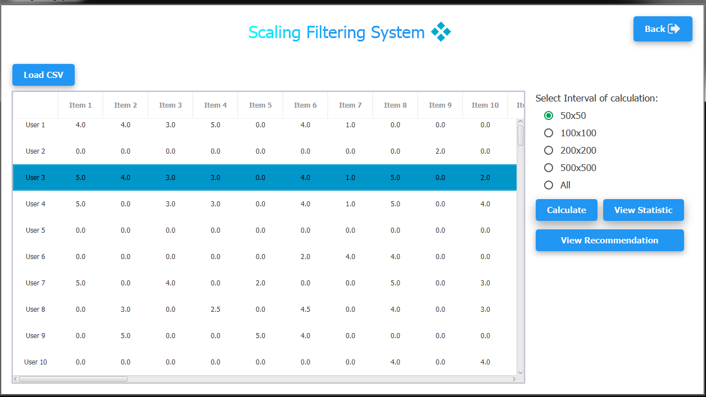

# Scaling Filtering System
Scaling in Cloud Computing Filtering (Recommendation System :heavy_check_mark:).

### Libraries used
* JFoenix (Material design)
* FontAwesomeFx (Icons)

### Requirements
* Java version 8 or higher.

### Screenshoot
Main           |
:---------------------:|
 |

Result           |
:---------------------:|
 |

Statistics           |
:---------------------:|
 |

### Installation
1. Download the repository files (project) from the download section or clone this project by typing in the bash the following command:

       git clone https://github.com/HouariZegai/ScalingFiltering.git
2. Imported it in Intellij IDEA and download the libraries used (montioned above) and add it in the project.
3. Run the application :D

### Contributing 💡
If you want to contribute to this project and make it better with new ideas, your pull request is very welcomed.
If you find any issue just put it in the repository issue section, thank you.
